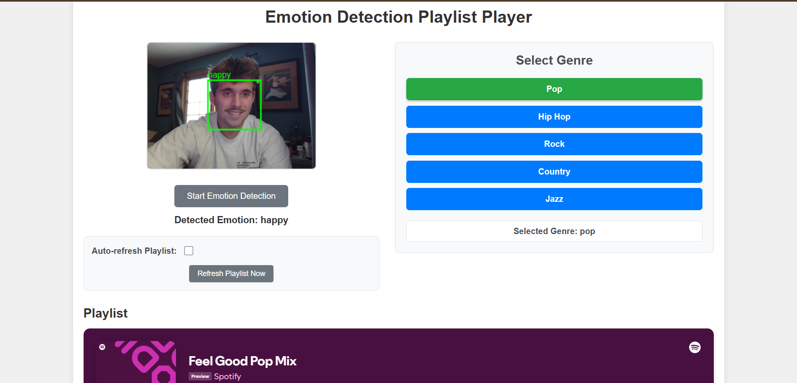

# Moodify

A modern web app that detects your emotion via webcam and plays a genre-specific Spotify playlist to match your mood. Built with Python (Flask), JavaScript, face-api.js, and Spotify embeds.

---

## 🖥️ Demo



---

## 🚀 Features

- **Real-time Emotion Detection:** Uses your webcam and face-api.js to detect emotions live.
- **Genre Selection:** Choose from Pop, Hip-Hop, Rock, Country, or Jazz.
- **Smart Playlist Mapping:** Combines your emotion and selected genre to play a matching Spotify playlist.
- **Responsive UI:** Clean, modern, and mobile-friendly interface.
- **Session Logic:** Remembers your last emotion and genre.
- **Manual & Auto Playlist Refresh:** Control when playlists update.

---

## 🛠️ Setup & Installation

1. **Clone the repository:**
   ```bash
   git clone https://github.com/yourusername/emotionplaylist.git
   cd emotionplaylist
   ```
2. **Install Python dependencies:**
   ```bash
   pip install -r requirements.txt
   ```
3. **Download face-api.js models:**
   - Download the following models and place them in `static/models/`:
     - `tiny_face_detector_model-weights_manifest.json`
     - `tiny_face_detector_model-shard1`
     - `face_expression_model-weights_manifest.json`
     - `face_expression_model-shard1`
   - You can get them from the [face-api.js GitHub releases](https://github.com/justadudewhohacks/face-api.js/tree/master/weights).
4. **Run the Flask server:**
   ```bash
   python app.py
   ```
5. **Open your browser:**
   - Go to [http://localhost:5000](http://localhost:5000)

---

## ⚙️ Configuration

- **Spotify Playlists:**
  - Edit `playlists.json` to map emotions and genres to your favorite Spotify playlists or tracks.
  - Use the format: `https://open.spotify.com/embed/playlist/PLAYLIST_ID` or `https://open.spotify.com/embed/track/TRACK_ID`

---

## 📦 Project Structure

```
emotionplaylist/
├── app.py
├── requirements.txt
├── playlists.json
├── static/
│   ├── script.js
│   ├── style.css
│   ├── favicon.ico
│   └── models/
├── templates/
│   └── index.html
├── demo_screenshot.png
└── README.md
```

---

## 🧑‍💻 Usage

- Click **Start Emotion Detection** and allow webcam access.
- Select a genre from the sidebar.
- The app will detect your emotion and play a matching playlist.
- Use the auto-refresh toggle and manual refresh button to control playlist updates.

---

## 🤝 Contributing

Pull requests are welcome! For major changes, please open an issue first to discuss what you would like to change.

---

## 🙏 Credits

- [face-api.js](https://github.com/justadudewhohacks/face-api.js)
- [Flask](https://flask.palletsprojects.com/)
- [Spotify](https://developer.spotify.com/documentation/widgets/generate/play-button/)